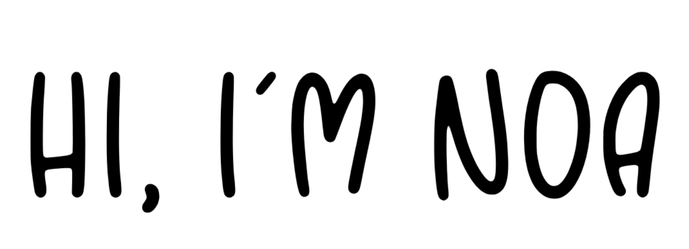

## Hi, I'm Noa :wave:

### About me :pushpin:
I'm computer science student.
Responsible, dedicated, great at managing my time, working in a team and getting things done.

### Skills: :computer:
##### - **Programming Languages :** Python, C, C++, Java.
##### - **Operating Systems :** Windows, Linux, macOS.
##### - **Development Tools :**  PyCharm, CLion, IntelliJ.

### Projects: :bulb:
##### :deciduous_tree: [Red-Black Tree Library](https://github.com/noamoalem/RBTree)

##### :mask: [Corona Apocalypse](https://github.com/noamoalem/CoronaApocalypse)

##### In my free time I like to read books :closed_book: and listen to music :headphones:

### You can find me :earth_asia:
[[[]]](https://www.linkedin.com/in/noa-moalem-bb0750202/)
